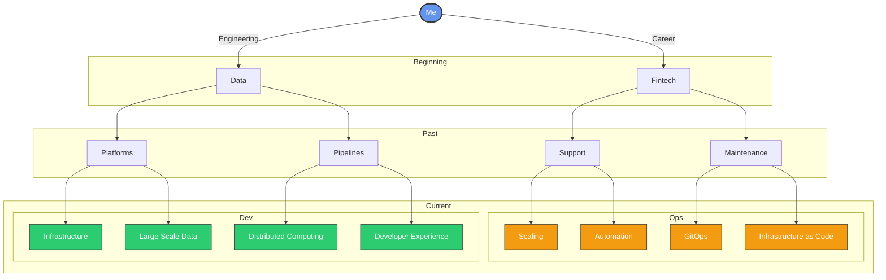

## Hi there 👋

<!--
**laimis9133/laimis9133** is a ✨ _special_ ✨ repository because its `README.md` (this file) appears on your GitHub profile.

Here are some ideas to get you started:

- 🔭 I’m currently working on ...
- 🌱 I’m currently learning ...
- 👯 I’m looking to collaborate on ...
- 🤔 I’m looking for help with ...
- 💬 Ask me about ...
- 📫 How to reach me: ...
- 😄 Pronouns: ...
- ⚡ Fun fact: ...
-->

I'm Laimis Juzeliūnas a DevOps engineer [@oxylabs](https://github.com/oxylabs) working within Data team. I take care of large scale platform builds, do my best to create a self healing infrastructure and enhance overall development experience.  
On my free time I like to contribute back to the open-source community with whatever I find and however I can.

